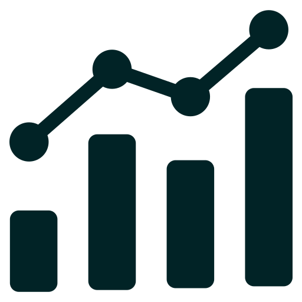

::::: services-grid
::: services-column

 **Analyse de vos données existantes**

**Exploitez vos données actuelles** Fournissez vos données et vos questions, on s'occupe de l'analyse   **Points d'influence stratégiques** Identifier où et comment influencer efficacement les décideurs   **Plan d'action personnalisé** Étapes concrètes à suivre selon vos résultats   **Analyse sentiment et opinion** Réseaux sociaux, commentaires publics et autres sources textuelles

 **Sondages clé-en-main**

**Prise en charge clé-en-main** De la conception du questionnaire à l'analyse, on s'occupe de tout   **Coordination avec les panels** On trouve le meilleur rapport qualité/prix et on gère la distribution   **Analyse et recommandations** Croisements sociodémographiques, segments clés, pistes stratégiques   **Implication flexible** Quelques validations par courriel ou rencontres de travail conjointes, selon vos préférences  **Revue de littérature scientifique** Contextualisation de vos enjeux avec la recherche existante

:::

::: services-column

 **Accompagnement stratégique de campagnes politiques**

**Tableaux de bord temps réel** Suivi interactif des données récoltées sur le terrain   **Analyses électorales** Optimisation du positionnement, appropriation d'enjeux, identification de bassins d'électeurs potentiels   **Formation et collecte terrain** Formation de vos équipes/bénévoles pour récolter des données sur le terrain   **Optimisation communications** Ajustements basés sur les données

 **Financement & levée de fonds**

**Profils de donateurs** Analyses démographiques et comportementales   **Croisement de données** Vos données + sources publiques (Élections Québec, etc.)   **Sources de financement** Identification d'opportunités potentielles   **Stratégies personnalisées** Collecte de fonds avec suivi continu

:::
:::::

------------------------------------------------------------------------

## Prêt à commencer ?

Discutons de votre projet lors d'une première consultation gratuite.

::: {style="text-align: center; margin: 30px 0;"}
<a href="contact.html" class="btn btn-primary btn-lg" style="background-color: #56d1d7; border-color: #56d1d7; color: #012326; text-decoration: none; padding: 15px 30px; border-radius: 8px; font-weight: bold; font-size: 18px;"> Première consultation gratuite</a>
:::

------------------------------------------------------------------------

## Pourquoi travailler avec Opubliq ?

**EXPERTISE TERRAIN & SCIENTIFIQUE**  Notre équipe combine expérience terrain concrète, expertise en analyse de données et rigueur scientifique. Nous maîtrisons autant la pratique que la théorie, ce qui nous permet de vous offrir des analyses solides et des recommandations applicables.

 

**PARTENARIATS & MANDATS À LONG TERME**  Nous sommes ouverts aux longs mandats et partenariats stratégiques. Notre objectif est de nous établir durablement dans le marché en créant des relations de confiance avec nos clients. Nous privilégions les collaborations à long terme qui nous permettent de vraiment comprendre vos enjeux.

 

**FLEXIBILITÉ & ADAPTATION**  Nous sommes flexibles et adaptatifs selon vos besoins spécifiques et votre budget. Que vous ayez un projet ponctuel, des contraintes budgétaires particulières ou des échéanciers serrés, nous ajustons notre approche pour vous offrir exactement ce dont vous avez besoin.

 

**INVESTISSEMENT DANS LES RELATIONS DURABLES**  Nous privilégions la construction de relations de confiance à long terme plutôt que la maximisation des profits à court terme. Cette approche nous permet d'offrir un excellent rapport qualité-prix tout en développant des études de cas exemplaires qui bénéficient à tous nos clients.